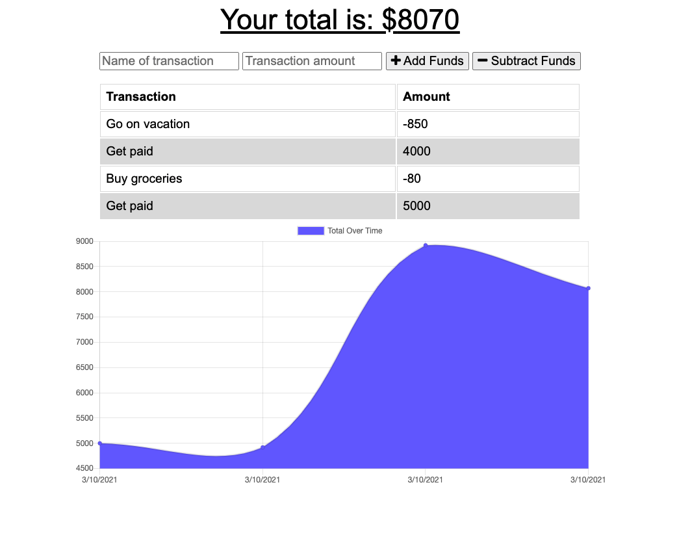

# Build-a-Budget

## Description

A basic budget tracking application for monitoring your expenses both online and offline.

## Table of Contents

- [Installation](#installation)
- [Usage](#usage)
- [Technologies](#technologies)
- [Deployed URL](#deployed-url)
- [License](#license)

## Installation

Navigate the deployed Heroku URL to begin.

## Usage

1. Open the app via the URL [here](#deployed-url)
2. Enter a name for your transaction
3. Enter a transaction amount
4. Choose to either add or subtract these funds from your budget total

**Note** In the event that your server is down, and you need to use the application offline, you can still add transactions to your budget tracker. When connection is restored, your transaction list and chart will be updated.

## Technologies

- `NodeJS`
- `Mongoose`
- `Morgan`
- `Compression`
- `IndexedDB`, `Manifest`, `Service Worker`

## Deployed URL

[https://budget-tracker-116.herokuapp.com/](https://budget-tracker-116.herokuapp.com/)

## Questions

If you have any questions, please contact jimbopulos at james.mgalantino@gmail.com

## License

MIT License

Copyright (c) 2021 James Galantino

Permission is hereby granted, free of charge, to any person obtaining a copy
of this software and associated documentation files (the "Software"), to deal
in the Software without restriction, including without limitation the rights
to use, copy, modify, merge, publish, distribute, sublicense, and/or sell
copies of the Software, and to permit persons to whom the Software is
furnished to do so, subject to the following conditions:

The above copyright notice and this permission notice shall be included in all
copies or substantial portions of the Software.

THE SOFTWARE IS PROVIDED "AS IS", WITHOUT WARRANTY OF ANY KIND, EXPRESS OR
IMPLIED, INCLUDING BUT NOT LIMITED TO THE WARRANTIES OF MERCHANTABILITY,
FITNESS FOR A PARTICULAR PURPOSE AND NONINFRINGEMENT. IN NO EVENT SHALL THE
AUTHORS OR COPYRIGHT HOLDERS BE LIABLE FOR ANY CLAIM, DAMAGES OR OTHER
LIABILITY, WHETHER IN AN ACTION OF CONTRACT, TORT OR OTHERWISE, ARISING FROM,
OUT OF OR IN CONNECTION WITH THE SOFTWARE OR THE USE OR OTHER DEALINGS IN THE
SOFTWARE.
